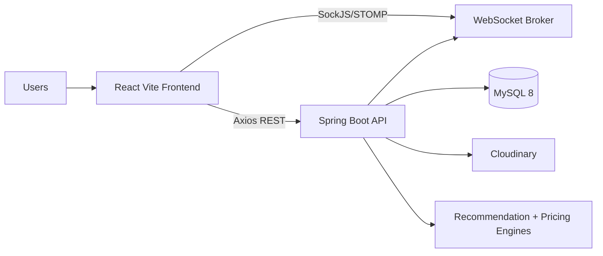
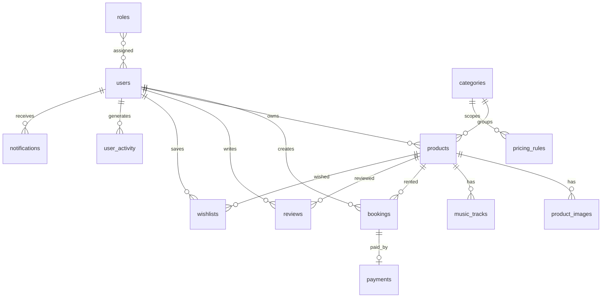
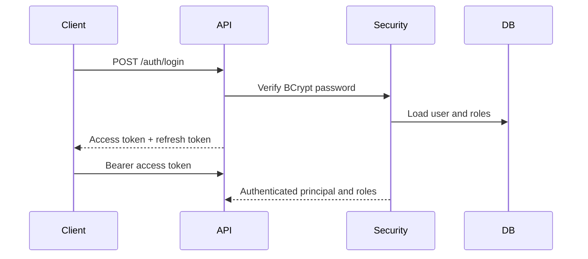
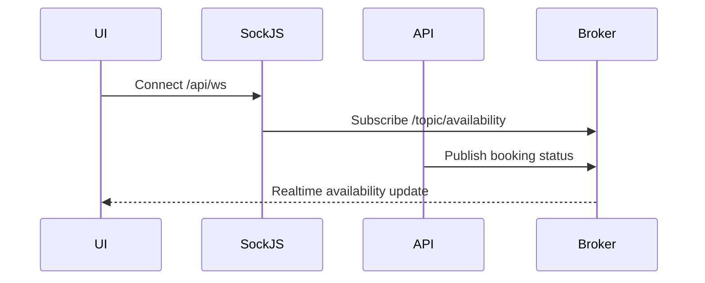
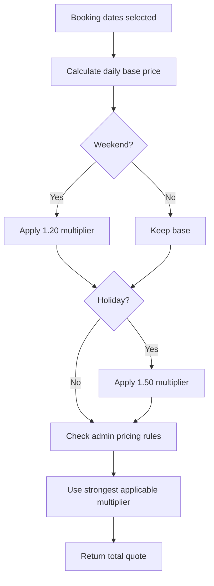

# MelodyRent

MelodyRent is a production-ready full-stack rental marketplace that blends Airbnb-style bookings, Spotify-inspired product playlists, Pinterest-like visual discovery, and realtime rental availability.

## Features

- Customer, product owner, and admin roles with JWT-secured access.
- Product marketplace for cars, bikes, cameras, laptops, gaming devices, drones, and premium gear.
- Search, filtering, sorting, pagination, wishlist-ready architecture, reviews, bookings, payments, notifications, and gamification.
- Product music experience with playlist controls: play, pause, next, previous, shuffle, repeat, and volume.
- Realtime availability and notifications with Spring WebSocket, STOMP, and SockJS.
- AI-style recommendation engine based on views, searches, wishlist activity, and bookings.
- Dynamic pricing with weekend, holiday, peak-season, and admin-configurable multipliers.
- Interactive 360° product viewer built with React Three Fiber and Three.js.
- Cloudinary integration for image and music uploads.
- MySQL 8 schema, Dockerfiles, Docker Compose, seed data, API documentation, and environment configuration.

## Architecture Overview



## System Design

The backend is organized around controllers, services, repositories, entities, DTOs, security, WebSocket configuration, exception handling, and Cloudinary integration. The frontend is organized by pages, reusable components, layouts, routes, Redux slices, services, hooks, animation presets, and Three.js components.

## Technology Stack

### Frontend
React, Vite, Tailwind CSS, Redux Toolkit, React Router, Axios, Framer Motion, React Three Fiber, Three.js, React Icons, STOMP, and SockJS.

### Backend
Java 21, Spring Boot 3, Spring Security, JWT, Spring WebSocket, Spring Data JPA, Hibernate, Maven, Springdoc OpenAPI, Cloudinary SDK, and MySQL Connector/J.

### Database and Infrastructure
MySQL 8, Docker, Docker Compose, and Nginx for the frontend container.

## Folder Structure

```text
backend/
 ├── src/main/java/com/melodyrent
 │   ├── config
 │   ├── controller
 │   ├── dto
 │   ├── entity
 │   ├── exception
 │   ├── mapper
 │   ├── repository
 │   ├── security
 │   ├── service
 │   ├── util
 │   └── websocket
 └── src/main/resources
frontend/src
 ├── pages
 ├── components
 ├── layouts
 ├── routes
 ├── redux
 ├── hooks
 ├── services
 ├── animations
 ├── threejs
 ├── assets
 ├── contexts
 └── utils
database/
docker-compose.yml
```

## Database Design

Core tables include `users`, `roles`, `products`, `categories`, `product_images`, `music_tracks`, `bookings`, `payments`, `reviews`, `wishlists`, `user_activity`, `pricing_rules`, and `notifications`.

## ER Diagram



## API Documentation

When the backend is running, Swagger UI is available at:

```text
http://localhost:8080/api/docs
```

### Key Endpoints

| Module | Method | Endpoint | Purpose |
|---|---:|---|---|
| Auth | POST | `/api/auth/register` | Register a user |
| Auth | POST | `/api/auth/login` | Login and receive JWT tokens |
| Products | GET | `/api/products` | Search and page products |
| Products | GET | `/api/products/{id}` | Product details |
| Products | POST | `/api/products` | Owner/admin listing creation |
| Bookings | POST | `/api/bookings/quote` | Dynamic price quote |
| Bookings | POST | `/api/bookings` | Confirm booking |
| Bookings | GET | `/api/bookings/me` | Customer booking history |
| Recommendations | GET | `/api/recommendations` | Personalized or trending products |
| Uploads | POST | `/api/uploads` | Cloudinary upload |
| Categories | GET | `/api/categories` | List categories |

## Authentication Flow



## WebSocket Workflow



## Recommendation Engine Explanation

The recommendation service reads recent `user_activity` records. If a recent product category exists, MelodyRent recommends approved products from that category. If no activity exists, it falls back to trending recently-created approved products.

Tracked activity types include `VIEW`, `SEARCH`, `WISHLIST`, and `BOOKING`.

## Dynamic Pricing Workflow



## Product Music Playlist Workflow

When a product details page opens, the frontend loads that product's `musicTracks` into the Redux player. The floating player provides Spotify-like playback controls and automatically starts the playlist when browser autoplay rules allow it.

## 360° Viewer Explanation

The `ProductViewer` component uses React Three Fiber, Drei, OrbitControls, lighting, and an animated 3D placeholder mesh. It is structured so production teams can replace the placeholder with Cloudinary-hosted `.glb` or `.gltf` product models.

## Cloudinary Setup

Set these backend environment variables:

```env
CLOUDINARY_CLOUD_NAME=your-cloud
CLOUDINARY_API_KEY=your-key
CLOUDINARY_API_SECRET=your-secret
```

Images can use `resourceType=image`; music files can use `resourceType=video` or `auto` depending on Cloudinary account settings.

## Environment Variables

### Backend

```env
DB_URL=jdbc:mysql://localhost:3306/melodyrent?createDatabaseIfNotExist=true&useSSL=false&allowPublicKeyRetrieval=true&serverTimezone=UTC
DB_USERNAME=melodyrent
DB_PASSWORD=melodyrent
JWT_SECRET=replace-with-a-long-256-bit-production-secret
JWT_ACCESS_MINUTES=30
JWT_REFRESH_DAYS=14
CORS_ALLOWED_ORIGINS=http://localhost:5173
CLOUDINARY_CLOUD_NAME=demo
CLOUDINARY_API_KEY=demo
CLOUDINARY_API_SECRET=demo
SERVER_PORT=8080
```

### Frontend

```env
VITE_API_URL=http://localhost:8080/api
```

## Installation Guide

### Backend Setup

```bash
cd backend
mvn spring-boot:run
```

### Frontend Setup

```bash
cd frontend
npm install
npm run dev
```

### Database Setup

```bash
mysql -u root -p < database/schema.sql
```

## Running Locally

1. Start MySQL 8.
2. Start the Spring Boot backend on port `8080`.
3. Start the Vite frontend on port `5173`.
4. Open `http://localhost:5173`.

Seeded demo accounts:

| Role | Email | Password |
|---|---|---|
| Admin | `admin@melodyrent.local` | `Password123!` |
| Owner | `owner@melodyrent.local` | `Password123!` |

## Docker Setup

```bash
docker compose up --build
```

Services:

- Frontend: `http://localhost:5173`
- Backend: `http://localhost:8080/api`
- Swagger: `http://localhost:8080/api/docs`
- MySQL: `localhost:3306`

## Deployment Guide

- Use a managed MySQL 8 database.
- Set `spring.profiles.active=prod`.
- Use a strong `JWT_SECRET` from a secret manager.
- Set exact CORS origins for production domains.
- Deploy backend as a Java 21 container or JVM service.
- Deploy frontend as static Vite assets behind a CDN or Nginx.
- Configure Cloudinary upload presets and account-level security.

## User Roles & Permissions

| Role | Permissions |
|---|---|
| Customer | Browse, search, wishlist, book, review, receive recommendations, view dashboard |
| Product Owner | Customer permissions plus product creation, inventory, booking management, earnings |
| Admin | Platform analytics, users, products, approvals, categories, pricing rules, reports, reviews |

## Testing Guide

- Backend: `mvn test`
- Frontend: `npm run build`
- Docker: `docker compose config`
- API docs: open `/api/docs` after backend startup.

## Troubleshooting Guide

- If MySQL connection fails, verify `DB_URL`, credentials, and that MySQL accepts public key retrieval.
- If JWT authentication fails, verify `JWT_SECRET` length and `Authorization: Bearer <token>` headers.
- If frontend cannot reach backend, verify `VITE_API_URL` and `CORS_ALLOWED_ORIGINS`.
- If Cloudinary uploads fail, verify API credentials and `resourceType`.
- If music autoplay does not start, browsers may require a user gesture before playback.

## Security Features

- BCrypt password hashing.
- JWT bearer authentication.
- Role-based authorization with Spring Security.
- DTO validation with Jakarta Validation.
- CORS configuration.
- Production profile with schema validation.
- Centralized exception handling.

## Performance Optimizations

- Frontend static build served by Nginx.
- Paginated product search.
- Lazy-ready route structure.
- Cloudinary-hosted media delivery.
- Stateless JWT API.
- WebSocket updates instead of polling.

## Future Enhancements

- Stripe or Razorpay payment provider adapter.
- Full review moderation workflows.
- Elasticsearch/OpenSearch advanced discovery.
- True ML recommendation model.
- Owner payout ledger.
- Native mobile app.
- Multi-region object delivery and CDN image transformations.

## Contributing Guide

1. Fork the repository.
2. Create a feature branch.
3. Keep backend, frontend, and database changes documented.
4. Run tests and builds before opening a pull request.
5. Include screenshots for visible UI changes.

## License

This project is provided as a portfolio-ready marketplace foundation. Add your preferred license before production distribution.
